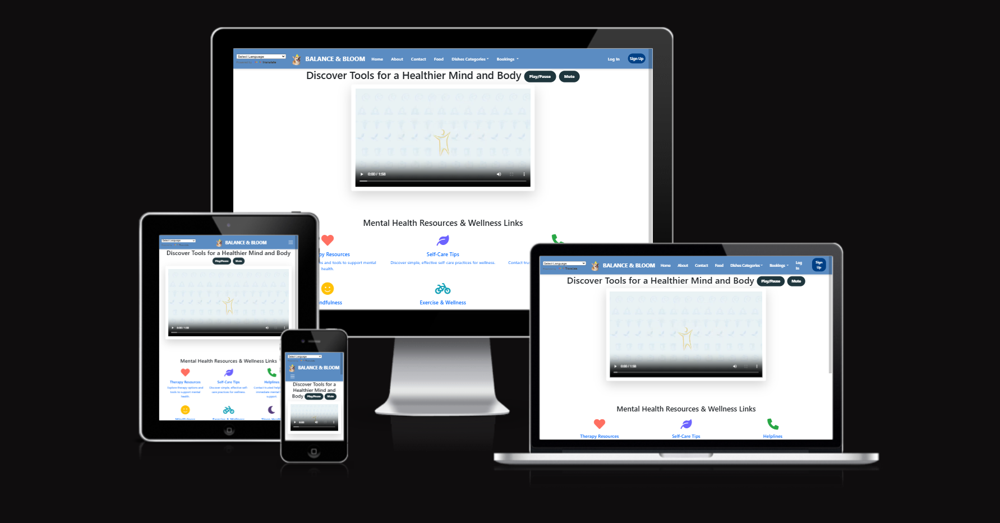
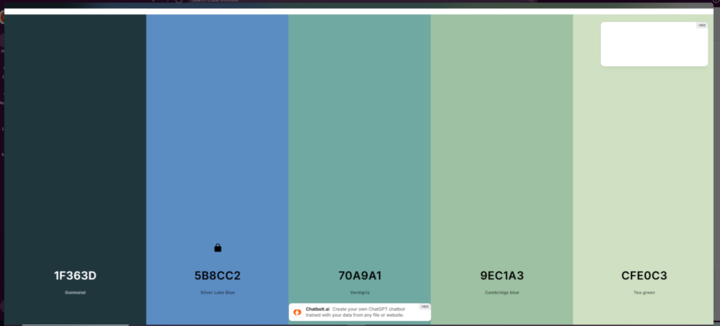
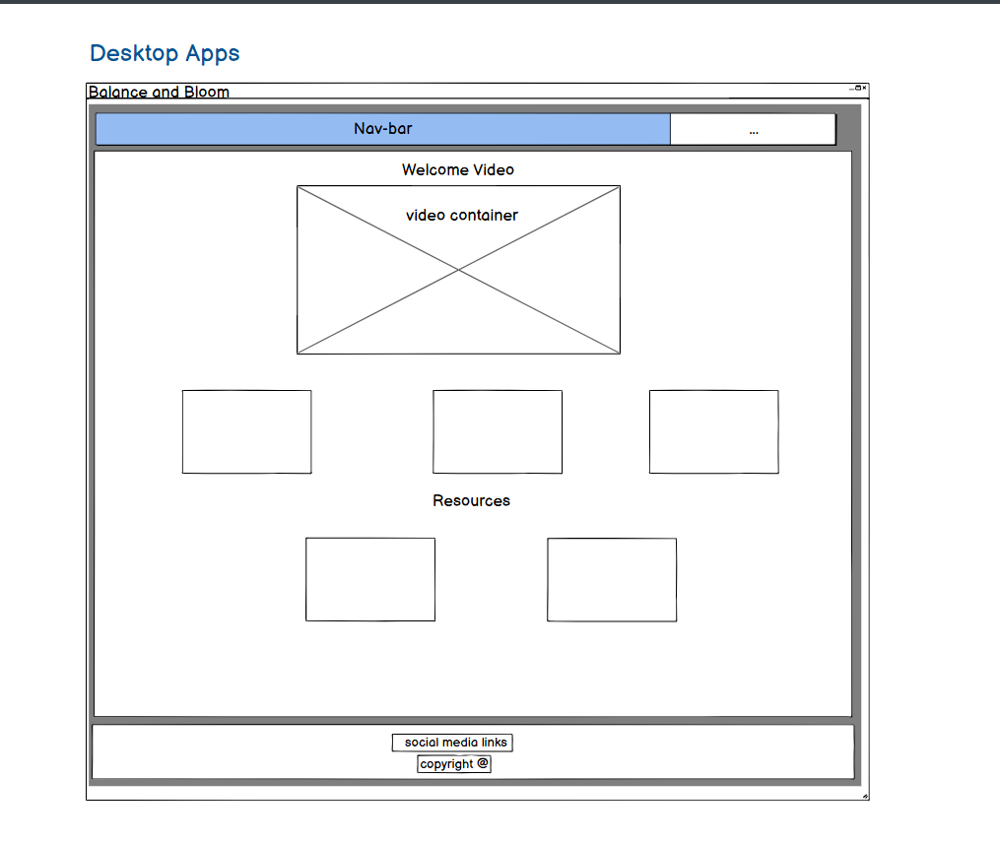
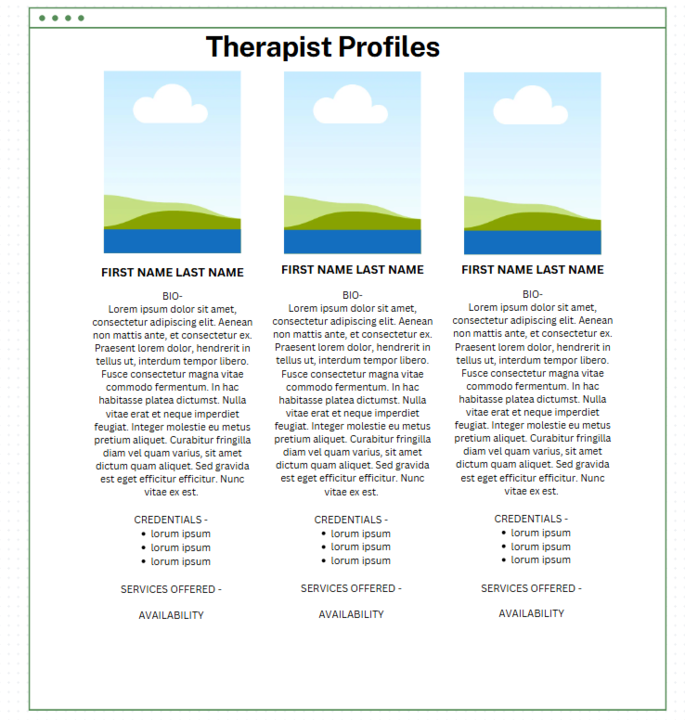
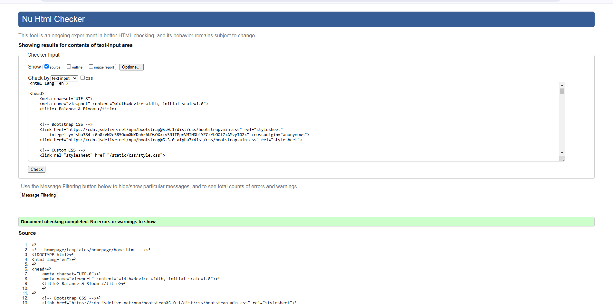
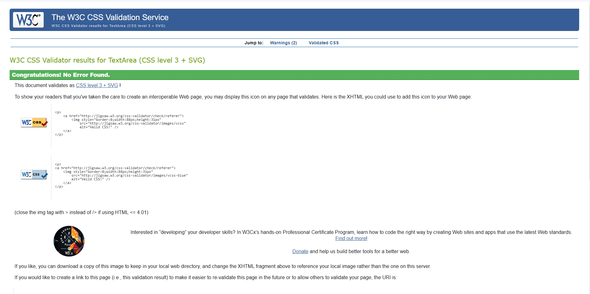
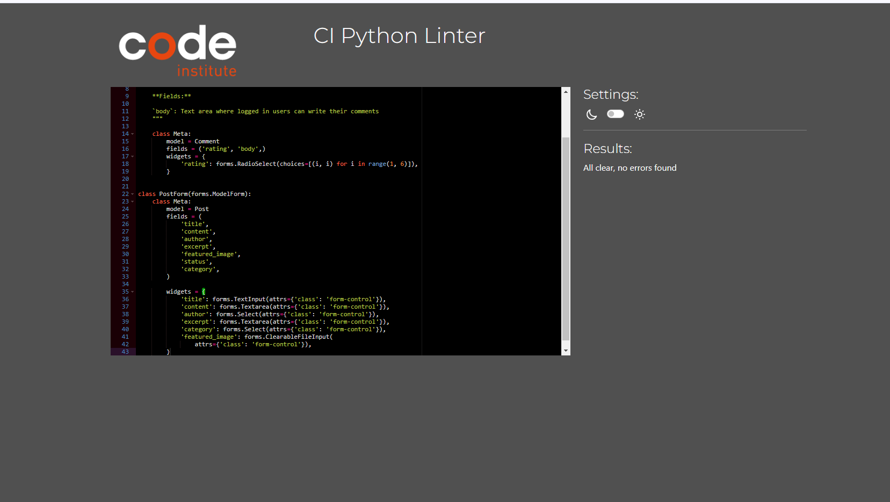

## Project

Balance and Bloom Project is designed to empower students with practical tools, supportive resources, and expert insights to foster mental well-being, resilience, and personal growth. Whether you're navigating stress, seeking mindfulness practices, or simply looking for ways to prioritize your mental health, we're here to guide you every step of the way. Join us in creating a space where students can thrive academically and emotionally, finding balance and blooming into their fullest potential.

The project is part of the Code Institute's Full-Stack Developer course and focuses on Django framework, database manipulation, and CRUD functionality.

Developers:

-  <a href="https://github.com/MEdw4rds">Matthew Edwards</a>

-  <a href="https://github.com/ArunVG1963">Arun VenuGopal</a>

-  <a href="https://github.com/CapriceHolford">Caprice</a>

-  <a href="https://github.com/Madiha-babri">Madiha Babri</a>

Am I responsive: 

live site: <a href="https://balance-and-bloom-216aca79a0e2.herokuapp.com//">Balance and Bloom</a>

Github repository, click <a href="https://github.com/MEdw4rds/Balance-and-Bloom">Here</a>

# Table of Contents
1. <a href="#Lets Renovate - Home Decorating Blog">Introduction</a>
2. <a href="#overview">Overview</a>
3. <a href="#ux---user-experience">UX - User Experience</a>
4. <a href="#features">Features</a>
- <a href="#key-project-goals">Key project goals</a>
- <a href="#target-audience">Target Audience</a>
- <a href="#agile-methodologies">Agile Methodologies</a>
- <a href="#moscow-prioritization">MoSCoW Prioritization</a>
- <a href="#sprints">Sprints</a>
- <a href="#wireframes">Wireframes</a>
- <a href="#database-schema---entity-relationship-diagram">Database Schema - Entity Relationship Diagram</a>
5. <a href="#features">Features</a>
- <a href="#navigation-bar">Navigation bar</a>
- <a href="#home-page">Home Page</a>
- <a href="#Contact-page">contact Page</a>
- <a href="#about-page">About page</a>
- <a href="#bookings">Bookings</a>
- <a href="#food">Food</a>
- <a href="#crud-functionality-alerts">CRUD Functionality Alerts</a>
- <a href="#future-features">Future Features</a>
- <a href="#footer">Footer</a>
6. <a href="#technologies-&-languages-Used">Technologies & Languages Used</a>
7. <a href="#lets-renovate---home-decorating-blog">Libraries & Frameworks</a>
8. <a href="#bugs">Bugs</a>
9. <a href="#deployment">Deployment</a>
10. <a href="#credits">Credits</a>
11. <a href="#acknowledgements">Acknowledgements</a>

## Overview

The website’s main goal is to improve the mental, emotional, and physical health of students by providing easy access to essential services like therapy appointments and healthy food options, all in one platform. It serves as a one-stop-shop to support students' well-being, helping them manage stress, maintain a healthy diet, and get professional mental health support.

# UX - User Experience

### Key project goals

1. Therapists Booking System:
Objective: To provide students with easy access to mental health professionals and therapists for online or in-person appointments.

2. Food Options & Meal Planning:
Objective: To provide healthy, convenient food choices for students, making it easier to maintain a balanced diet, especially during stressful times like exams.

3. Holistic Wellness Resources:
Objective: To foster a well-rounded approach to student wellness, including resources for relaxation, physical activity, and stress management.

### Target Audience

The Student Wellness Website that offers therapists' booking services and food options primarily targets college and university students, but it also extends to other related groups such as graduate students, international students, student-athletes, and students dealing with specific challenges like mental health concerns or time management difficulties. The audience is united by a shared need for support in balancing their academic, emotional, and physical well-being.

### Agile Methodologies

This was a group project as a part of Hackathon two, so we used an agile approach to project management. The Balance and Bloom development process was broken into sprints, and tasks were added to the GitHub, tasks were assigned and project board was created to be tracked and managed through issues.

### MoSCoW Prioritization

### Sprints

- Sprint 1: Initial Setup - Project, repository, environment setup, Task destribution.
- Sprint 2: User Authentication, post & comment model, therapists_profile.
- Sprint 3: Design search & Appointment Booking System.
- Sprint 4: Static Pages & UI/UX Improvements.
- Sprint 5: Deployment & Testing

### User stories

1. As a student I need to research project ideas so that I can choose a topic that aligns with my skills and meets the course requirements.

2. As a student I need to define the purpose and target audience of my project so that I can create a solution that meets their needs effectively

3. As a Site User I can click on the About link so that I can read about the site.

4. As a student, I need to create wireframes for my project, so that I can visually plan and structure my pages in alignment with user needs and project requirements.

5. As a student, I can register an account with my email and password so that I can access resources, book sessions, and manage my wellness activities.

6. As a therapist/instructor, I can create and manage my profile so that students can view my expertise and book sessions with me.

7. As a student, I can browse and book events or sessions (e.g., yoga, therapy, meditation) so that I can participate in wellness activities that suit my needs.

8. As a site user I can search anytime through search bar so that I can find what I am looking for on website (moved to future features)

9. As a student, I can access wellness resources such as articles, videos, and podcasts so that I can learn more about mental and physical health.

10. As a Food Vendor I can add healthy foods so that students can select and order food directly (future features)

### Typography

Different apps were made in this project with diffrent font-styles.

- Varchar from walk through project

- lato, sans-serif

- roboto

- georgia

### Colour Scheme

## Wireframes

- ### Home Page Wireframes

- #### About Page:

- #### Food Page:

- Mobile View

- Desktop View

- #### Contact Page:

- #### Booking Page:

- Mobile View

- Desktop View

- #### Profile Page:

### Database Schema - Entity Relationship Diagram

The ERD shown below illustrates the relationships between the users, therapists appointments, acontact page,food posts comments and ratings, and more. This is essential to demonstrate the relationships between the different models in the PostgreSQL database.

# Features

- ### Navigation bar
A responsive navigation bar is in place. Concentrating on 'mobile first' design, the navigation bar incorporates a clickable burger icon with a drop down menu on mobile. There is a burger icon at tablet size too, but when moving to monitor size the burger disappears and a navigation bar appears with options to navigate to pages. See mobile and monitor screenshots below.

- ### Mobile Navb-bar with toggler

- ### Desktop Navbar

- ### About

- ### Contact

A contact form is created for students to contact team.

- ### Bookings

- ### Profiles

- ### Food Categories

- Recipies page

- Food posts

- ### CRUD Functionality of Comment and Rating Model

1. Create 
Users are automatically assigned a profile upon registration. They can create bookings and post comments.

2. Read
Users can view bookings, recipies and associated information, including ratings and comments.

3. Update
Users have the ability to update their ratings and comments.

4. Delete
Users can delete comments/bookings at any time.

- ### Signup/signin Form

- ### Django Alert Messages
Every time there is a change in data the user is alerted. For example when a comment is posted, when a comment is edited, when a comment is deleted, when a booking is created, when a booking is edited or when a booking is deleted.

- ### Future Features

- As a Food Vendor I can add healthy foods so that students can select and order food directly (future features)

- As a site user I can search anytime through search bar so that I can find what I am looking for on website (moved to future features)

- ### Footer

# Technologies & Languages Used

- HTML5 - Markup language for structuring the website
- CSS3 - Styling language for designing the layout and visual aesthetics
- JavaScript - For interactivity and DOM manipulation on the frontend
- Python (Django) - Backend web framework for server-side logic and management
- PostgreSQL - Database management system for storing data
- Cloudinary - Cloud-based image storage solution
- Whitenoise - For serving static files directly from Django

# Libraries & Frameworks

- Django - Backend framework
- Django Crispy Forms - For elegant form rendering
- Cloudinary - Media storage
- Whitenoise - For serving static files

# Tools & Programs

- GitHub Projects - Project management and tracking
- Heroku - Deployment and hosting
- Balsamiq - Wireframes and design prototypes

# Testing

## Validation Testing

- ### HTML: W3C Markup Validator.

Every template in Apps was checked. Code was check through HTMl validator.

- ### CSS: W3C CSS Validator.

style sheets were checked through w3c css validator. Error were found but sorted and clear error free style sheet was updated.

- ### Python: PEP8 validation to ensure code quality.

# Deployment
All code for this project was written in Visual Studio/Gitpod as the integrated development environment. GitHub was used for version control, and the application was deployed to Heroku from GitHub.

## Creating Repository on GitHub

- First make sure you are signed into Github and go to the code institutes template, which can be found here.
- Then click on use this template and select Create a new repository from the drop-down. Enter the name for the repository and click Create repository from template.
- Once the repository was created, I clicked the green gitpod button to create a workspace in gitpod so that I could write the code for the site.

## Creating an app on Heroku

- After creating the repository on GitHub, head over to heroku and sign in.
- On the home page, click New and Create new app from the drop down.
- Give the app a name(this must be unique) and select a region I chose Europe as I am in Europe, Then click Create app

## Pre-Deployment

To ensure a successful deployment to Heroku, the following practices are to be followed (Experience from previous Django projects):

- Requirements File:  The requirements.txt file must be kept up to date to ensure all imported Python modules are configured correctly for Heroku.
- Procfile:  A Procfile was added to configure the application as a Gunicorn web app on Heroku.
- Allowed Hosts:  In settings.py, the ALLOWED_HOSTS list was configured to include the Heroku app name and localhost. Example format:

ALLOWED_HOSTS = ['your-app-name.herokuapp.com', 'localhost']

- Environment Variables:  All sensitive data such as the DATABASE_URL, CLOUDINARY_URL, and SECRET_KEY were added to the .env file, which is ignored by Git using .gitignore. These variables are added to Heroku manually through the Config Vars section.

## Deploying with Heroku

The steps for deploying to Heroku are as follows (Experience from previous Django projects):

1. Create New App: Log in to your Heroku account and click on the "Create New App" button.
2. App Name: Choose a unique name for your app.
3. Select Region: Choose the appropriate region (Europe was selected for this project).
4. Create App: Click the "Create App" button to proceed.
5. Deployment Method: In the "Deploy" tab, select GitHub as the deployment method.
6. Connect to GitHub: Search for the repository name and click "Connect".
7. Manual or Automatic Deployment: Select either manual or automatic deployment. Ensure the main branch is selected for deployment.
8. Config Vars: In the "Settings" tab, click "Reveal Config Vars" and input the required environment variables.
9. Buildpack: Select Node.js and Python as the buildpacks for your project.
10. Deploy: Once the configuration is complete, click the "Deploy Branch" button. After successful deployment, a "View" button will appear to take you to the live site.

# Acknowledgements

- Very special thankx to our mentors and advisors, Marko, John Rearden and Mark Briscoe for helping us at every stage. This project would not have been the same without their invaluable mentorship.